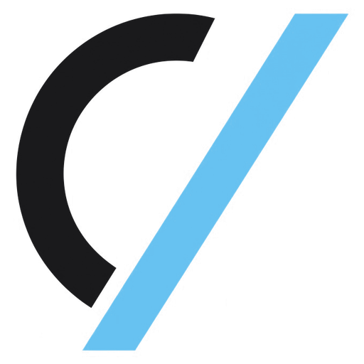

<p align="center">
  
</p>

# RAMU — Creative Opportunity Engine

> **Platform Kolaborasi Ekonomi Kreatif Berbasis Analisis Komplementaritas Resource Deterministik**

---

## 🌟 Tentang RAMU

**RAMU** adalah platform kolaborasi masa depan bagi ekosistem industri kreatif mode dan visual. Berbeda dari direktori talenta konvensional yang hanya mempertemukan pihak secara pasif, RAMU bertindak sebagai mesin pembentuk peluang (*Opportunity Engine*): mengidentifikasi bagaimana kapasitas menganggur (*idle capacity*), keahlian, dan aset fisik dapat saling melengkapi untuk menciptakan karya komersial terukur tanpa spekulasi.

Platform ini memfasilitasi kolaborasi terintegrasi antar 5 peran resmi dalam industri mode:
* 👗 **Fashion Brand / UMKM**: Menyediakan sampel busana koleksi (*ready-to-wear* / wastra) dan visi kampanye.
* 📷 **Fotografer**: Mengoptimalkan keahlian visual komersial, bodi kamera kelas profesional, dan pencahayaan studio.
* 🏢 **Studio & Venue**: Mengaktifkan jadwal kosong (*idle time*) ruang daylight dan fasilitas *infinity cyclorama*.
* 👠 **Model**: Memfasilitasi comp-card terverifikasi, portofolio editorial, dan dedikasi pose katalog.
* 💄 **MUA & Stylist**: Menghadirkan kit tata rias berstandar higienis tinggi, konsep tata gaya, dan arsip aksesori.

---

## 🚀 Keunggulan & Fitur Utama

### 1. Mesin Analisis Komplementaritas Deterministik
Sistem mengevaluasi potensi kolaborasi secara terukur dan transparan melalui **6 Dimensi Objektif**:
* **Complementarity**: Menghitung seberapa presisi aset satu pihak mengisi kebutuhan pihak lainnya.
* **Goal Alignment**: Memastikan keselarasan target pasar, visi artistik, dan tujuan kampanye.
* **Need Coverage**: Mengukur kelengkapan seluruh elemen produksi yang dibutuhkan dalam satu brief.
* **Asset Utilization**: Memaksimalkan utilitas peralatan, ruangan, dan sampel busana yang sedang idle.
* **Feasibility**: Menguji kelayakan jadwal ketersediaan, kapasitas daya listrik, dan kebutuhan operasional.
* **Actionability**: Menilai kesiapan proyek untuk segera masuk tahap pra-produksi dan eksekusi.

### 2. Standarisasi Perjanjian Kerja (SPK) Digital Otomatis
Setiap kesepakatan kolaborasi dilindungi oleh kontrak digital terstandar yang memuat:
* Pengaturan hak pakai karya (*usage rights*) digital, e-commerce, maupun cetak komersial.
* Struktur termin kompensasi yang adil dan transparan.
* Perlindungan hak moral dan atribusi kredit bagi seluruh kreator yang terlibat.
* Klausul perlindungan hak cipta dan jaminan non-kompetisi sesuai durasi proyek.

### 3. Ekosistem Terkurasi & Profil Spesifikasi Mendalam
Setiap profil talenta dan ruang produksi diverifikasi dengan data teknis autentik:
* **Comp-Card Model**: Statistik fisik terstandar, ukuran busana & sepatu, serta dokumentasi polaroid resmi.
* **Spesifikasi Teknis**: Rincian gear kamera, kemampuan *tethering on-set*, daya listrik studio, dan kit tata rias resmi.
* **Struktur Paket Kolaborasi**: Kejelasan lingkup kerja, durasi pemotretan, jumlah looks, serta batas revisi.

### 4. Aktivasi Kapasitas Idle & Efisiensi Biaya
Mengurangi hambatan modal bagi brand independen dan memaksimalkan pendapatan bagi pemilik ruang dan peralatan dengan mengubah waktu senggang menjadi portofolio bernilai ekonomi.

---

## 🔄 Alur Kolaborasi

```
┌──────────────────┐     ┌──────────────────┐     ┌──────────────────┐     ┌──────────────────┐
│   1. Registrasi  │ ──> │   2. Penemuan    │ ──> │    3. Evaluasi   │ ──> │   4. Penerbitan  │
│   & Input Aset   │     │   & Matching     │     │   Brief Bersama  │     │   SPK & Eksekusi │
└──────────────────┘     └──────────────────┘     └──────────────────┘     └──────────────────┘
```

1. **Registrasi & Kurasi Profil**: Masukkan keahlian, aset inventaris, atau ruang studio beserta ketersediaan waktu.
2. **Matching Cerdas**: Sistem menghitung tingkat kompatibilitas dan merekomendasikan mitra yang saling melengkapi.
3. **Penyusunan Brief & Kesepakatan**: Pihak-pihak terkait menyelaraskan konsep visual, moodboard, dan jadwal pemotretan.
4. **Penerbitan Kontrak & Produksi**: SPK digital terbit secara otomatis untuk melindungi seluruh pihak selama proses produksi hingga rilis karya.

---

## 💻 Teknologi yang Digunakan

* **Kerangka Aplikasi**: Next.js & React (Arsitektur Modern App Router dengan Engine Turbopack)
* **Bahasa Pemrograman**: TypeScript
* **Antarmuka & Desain**: Tailwind CSS & Vanilla Design System
* **Basis Data & Layanan Backend**: Supabase PostgreSQL & Prisma ORM
* **Keamanan & Autentikasi**: Supabase Authentication & Server-Side Security Policies

---

## 🛠️ Panduan Menjalankan Proyek

### Prasyarat Lingkungan
Pastikan perangkat Anda telah terpasang:
* **Node.js**: Versi 18.17+ atau 20+
* **npm**: Versi 9+

### Langkah Pemasangan

1. **Clone Repositori**:
   ```bash
   git clone https://github.com/gilangggra/RAMU.git
   cd RAMU
   ```

2. **Pengaturan Variabel Lingkungan**:
   Salin berkas contoh konfigurasi lingkungan:
   ```bash
   cp .env.example .env.local
   ```
   *Sesuaikan parameter koneksi basis data dan kunci API Supabase pada berkas `.env.local`.*

3. **Instalasi Dependensi**:
   ```bash
   npm install
   ```

4. **Menjalankan Server Pengembangan**:
   ```bash
   npm run dev
   ```
   Aplikasi dapat diakses melalui peramban di [http://localhost:3000](http://localhost:3000).

5. **Kompilasi Produksi**:
   ```bash
   npm run build
   ```

---

## 📄 Hak Cipta & Lisensi

Seluruh hak cipta, desain visual, dan arsitektur sistem dilindungi oleh **RAMU**.  
Dikembangkan untuk memajukan ekosistem ekonomi kolaboratif industri kreatif Indonesia.
